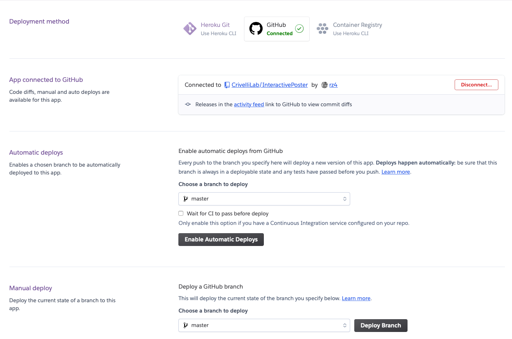

# iPoster: Interactive Poster
The following guide shows how to create and deploy a public
iPoster application using the Heroku platform.
The web application for the poster is implemented using
Flask, Dash, and Plotly.

This is this repo's [example iPoster](https://iposter-template.herokuapp.com/).

## Step 1. Fork this Github Repo:
Fork this repo into your Github account using the fork button at the
top of the page. After that, clone your forked repo using the
following command on your terminal.
```bash
git clone [forked-repo-url]
cd [forked-repo]
```

## Step 2. Create a `virtualenv` with required dependencies:
This process assumes you have Python3 and Pip installed.
Run the following Bash script found in the repo to
install the needed python packages.

```bash
source setup_env.sh
```

To load the virtualenv, run the following command.

```bash
source iposter-env/bin/activate
```

## Step 3. Implement your poster using the available tools:
The poster code can be found in `app.py`. There, you will find a function
called `create_poster` which defines the current template used in this guide.

Here is a commented version of that function:

## Step 4. Run your iPoster locally:
To make sure that your poster looks like you want it before deploying it
using Heroku, run the poster application locally. First change the
`RUN_LOCAL` flag in the `app.py` file to `True`.

```python
# file: app.py

#*** Run Local Flag ***
RUN_LOCAL=True
```

After this, run the dash application. Copy and paste the URL listed on the
terminal output.

```bash
$ python3 app.py
```

## Step 4. Deploy your iPoster on Heroku:

### Step 4.a. Create a free Heroku account:
[Account Signup](https://signup.heroku.com)

### Step 4.b. Create a new app:
After you log in to your Heroku app, click `Create a New App`.
Your application name will be the url domain.

### Step 4.c. Update the poster QRCode with the new app name:
Change the `POSTERURL` in `generate_qrcode.sh` to your application name from the
previous step.

```bash
POSTERURL=iposter-template

# Create QRCode
python iposter/qrcode.py $POSTERURL
```

After you change it, run the bash script.

```bash
source generate_qrcode.sh
```

### Step 4.d. Change `RUN_LOCAL` to `False`:
If `RUN_LOCAL` in `app.py` is still set to `True`, change it to `False` before moving
on to the next steps. You will get an error when deploying otherwise.

## Step 4.e. Export `virtaulenv`:
If you installed any other python packages for your poster,
run the following command to update your requirements file. This
assumes your virtaulenv is activated.

```bash
pip freeze > requirements.txt

```
### Step 4.e. Push the all your changes to Github:
Push all your changes to Github using the following commands.

```bash
git add *
git commit -m "Latest"
git push
```

### Step 4.f. Deploy your iPoster app:
After your changes have been pushed, go back to Heroku and
select the `Deploy` tab and link your Github account under
`Connect to Github`. Once you've linked your account, you can search for your repo
under the same section.



Select your repo, scroll down, and run a manual deployment of the application
by clicking on `Deploy Branch`. This may take a few minutes. Once it's done,
Heroku will give you a link to view your app.
